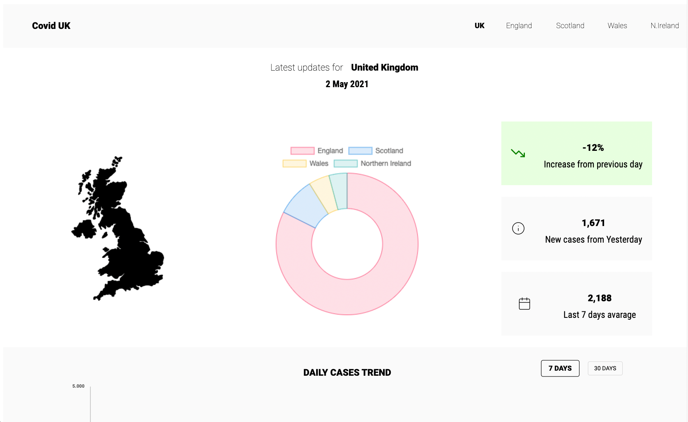
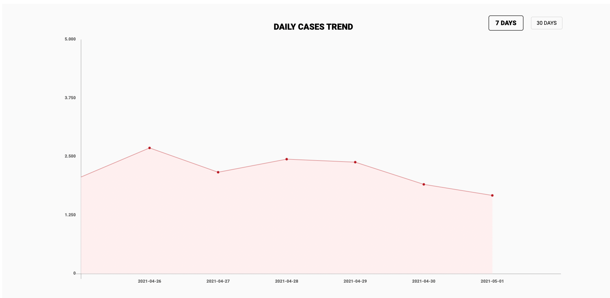
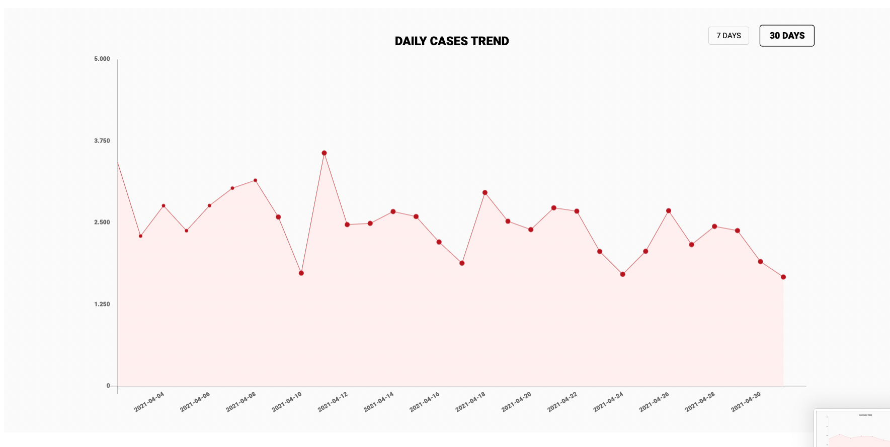

# Live covid-19 UK updates

An app that shows real time covid-19 data related to the UK, made with react and chart.js

## Objective 

* To display data in real-time related to Covid19

* Show weekly data in an area chart

* Dinamically change the area chart to a monthly dataset

## Skills and thechnical aspects to focus

* To build a React application
* Retrieve data from the [GOV.UK-Covid-19 API](https://coronavirus.data.gov.uk/details/developers-guide)
* Display the data through charts

## Links

### [Web-page link](https://www.theodhorshyti.com/CovidUk/index.html)
